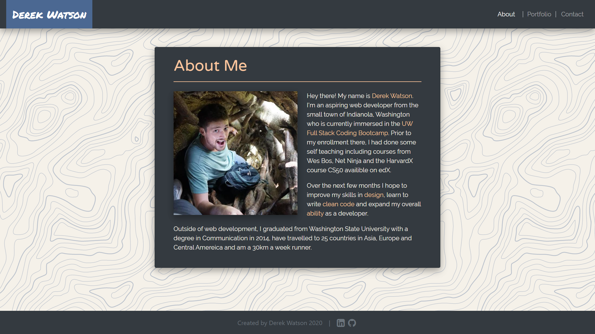

## Responsive Portfolio

This repository hosts my attempt at the third homework assignment of the UW Coding Boot Camp -
using Bootstrap to create a responsive "portfolio" site. I had a lot of fun learning Bootstrap and can
tell once I have it down it will be very easy to quickly create nice and consistent looking websites.

I wanted to use custom colors on my site, and decided to employ CSS variables to make them consistent
across pages and easy to manage (only change in one place).

It took quite a bit of effort to get it to look exactly how I wanted it. I was unable to entirely
eliminate media queries, and am unsure if my implementation of Bootstrap grid is perfect, but overall I
am happy with how it turned out.

#### View here:

https://derek-watson14.github.io/ResponsivePortfolio/index.html

#### Screenshot:

